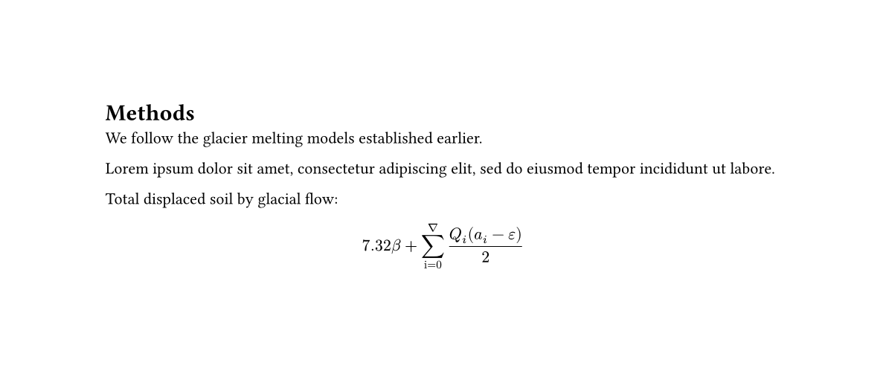

# Typst4K — Kotlin bindings for Typst


## Quick introduction

This library allows 

- Manipulating Typst values:
    
    ```kt
    val pattern = TPattern(
        size = TArray(30.pt, 30.pt),
        body = TSequence(
            TPlace(body = TLine(start = TArray(0.pc, 0.pc), end = TArray(100.pc, 100.pc))),
            TPlace(body = TLine(start = TArray(0.pc, 100.pc), end = TArray(100.pc, 0.pc))),
        )
    )
    ```
    (example from [official documentation on patterns](https://typst.app/docs/reference/visualize/pattern/))

- Converting them to the Typst code:

    ```kt
    pattern.repr()
    ```
    which produces 
    ```typ
    pattern(size: (0.0em + 30.0pt, 0.0em + 30.0pt), { place(line(start: (0.0%, 0.0%), end: (100.0%, 100.0%))); place(line(start: (0.0%, 100.0%), end: (100.0%, 0.0%))); })
    ```
    
    (Some cosmetic improvements are planned, but not the first priority)

- Accessing the Typst compiler:

    ```kt
    val typst = Typst("/home/user/.cargo/bin/typst")
    typst.compile(Path.of("test.typ")) {
        format = OutputFormat.SVG
        ppi = 1440
    }
    ```
    
    Optional arguments are provided via lambda configuration function.

    When no path for the typst compiler is provided, the default one is used.
    
    ```kt
    val typst = Typst()
    typst.query<TMetadata<TArray<TInt>>>(Path.of("test.typ"), selector(TLabel("lbl".t)))
    ```
    
    More on queries later.
    
    Besides, default parameters can be configured while creating the `Typst` object:
    
    ```kt
    Typst("typst", "./typst-custom-serial") {
        root = Path.of("src/typ")
        ppi = 1440
        compile {
            input("mode", "heavy")
        }
        query {
            input("mode", "lite")
        }
        watch {
            ppi = 144
        }
    }
    ```
  
    `"./typst-custom-serial"` here is a separate executable for performing queries (see section on queries). Also, `watch` is not supported, plan on adding it in the next version.

## Complex example

Here's the Typst code:

```typ
#set page(height:auto)

= Methods
We follow the glacier melting models
established earlier.

#lorem(15)

Total displaced soil by glacial flow:

$7.32 beta + sum_(i=0)^nabla (Q_i (a_i - epsilon)) / 2 $
```

And here's the reflection of it in the Kotlin code (Yeah, it's longer)

```kotlin
import org.ldemetrios.typst4k.orm.*
import org.ldemetrios.typst4k.rt.*
import java.io.File

fun main() {
    val content = TSequence(
        THeading(body = "Methods".text, depth = 1.t),
        TSpace,
        "We follow the glacier melting models established earlier.".text,
        TParbreak,
        TCustomContent("lorem", listOf(15.t), mapOf()),
        TParbreak,
        "Total displaced soil by glacial flow:".text,
        TParbreak,
        TEquation(
            TSequence(
                "7.32".text, TSpace, "β".text, TSpace, "+".text, TSpace,
                TAttach(
                    "∑".text,
                    t = "∇".text,
                    b = TSequence("i".text, "=".text, "0".text)
                ),
                TSpace,
                TFrac(
                    TSequence(
                        TAttach("Q".text, b = "i".text),
                        TSpace,
                        TLr(
                            TSequence(
                                "(".text,
                                TAttach("a".text, b = "i".text),
                                TSpace,
                                "−".text, TSpace, "ε".text, ")".text,
                            )
                        ),
                    ),
                    "2".text
                )
            ),
            block = true.t
        )
    )
    
    File("example.typ").writeText("#set page(height:auto)\n #" + content.repr())
    Typst("./typst").compile("example.typ", "example.png")
    File("example.typ").delete()
}
```

Both of them produce the same picture:



Unfortunately the `set` rules are not supported by Typst4k yet, but they will be.
Can't say for sure, when. It's hard, but certainly doable. 

Some part of the tree could be the actual code in typst: 

```kotlin
TCustomContent(
    "eval",
    listOf("\$ 7.32 beta + sum_(i=0)^nabla (Q_i (a_i - epsilon)) / 2 \$".t),
    mapOf("mode" to "markup".t)
)
```

## Installation 

This library is yet in the beta testing stage.
To use it, first install it to your local maven repo:

```bash
git clone https://github.com/LDemetrios/LDemetriosCommons.git
cd LDemetriosCommons 
gradle publish
cd ..

git clone https://github.com/LDemetrios/Typst4k
cd Typst4k
gradle publish
cd ..
```

(Or use an appropriate `gradlew` if you haven't installed gradle)

Then include it to your project:

### Maven

```xml
<dependency>
    <groupId>org.ldemetrios</groupId>
    <artifactId>typst4k</artifactId>
    <version>0.3.0</version>
</dependency>
```

### Gradle 
Kotlin DSL:
```kt
implementation("org.ldemetrios:typst4k:0.3.0")
```
Groovy DSL:
```groovy
implementation 'org.ldemetrios:typst4k:0.3.0'
```

## Specifics about queries

Queries have to be explicitly typed (`TValue` is the most general type).
Also, the syntax of `Selector`s is a bit wordy:

- `"str".t` -- creates a TStr
- `TLabel("str".t)` -- creates a TLabel
- `selector(TLabel("str".t))` -- creates a selector for label.

Here is a more complicated example:

```kt
TElementSelector("heading").where("level" to 1.t)
    .or(TElementSelector("heading").where("level" to 2.t))
```
    
It will be simplified later.

Note that `query<T>` returns `TypstCompilerResult<TArray<T>>`.  
You may handle the errors yourself or use `.orElseThrow()` to get the result.

Besides that, you'll need [the customized version of the Typst compiler](https://github.com/LDemetrios/typst-erased-serialize) to make queries.
(`compile` etc. requests work fine with the standard one) 
It is already PRed to the Typst (https://github.com/typst/typst/pull/4466).
If the authors approve this PR, it'll be possible to run queries with the official version of the compiler.
If they reject it, I’ll have to write a parser for the current serialization form, which I wouldn’t want to do.

How to compile the customized version:

```shell
git clone git@github.com:LDemetrios/typst-erased-serialize.git 
cd typst-erased-serialize || exit
cargo build --release 
cp target/release/typst ../typst-customized
# cd ../
# rm -rf typst-erased-serialize
```

## More details

I plan on creating a more detailed manual later.

## Changelog

See [file](Changelog.md)

## Plans

- [x] Split arguments for calls into separate chunks (avoiding multiple overloads)
- [x] Add tests
- [ ] Support `set` rules (`show` rules seem to be impossible to support)
- [ ] Improve type checking during deserialization
- [ ] Allow functions, which take primitive arguments (`int`, `str` etc) also accept corresponding Kotlin values (`Int`, `String`). 
- [ ] Support for Function as a superinterface for `companion`s
- [ ] Beautify `repr` (make more human-readable)
- [ ] Move to jj, and make manual updates to the generated code possible
- [ ] Add support for typed queries (query(heading) can only return THeading)
- [ ] Add support for labeled content

## Contacts

If you experience bugs or have a proposal for improvements, feel free to open issues. 
PRs are also welcome, feel free to ask questions about the internal structure of the project.

tg: @LDemetrios

mail: ldemetrios@yandex.ru
